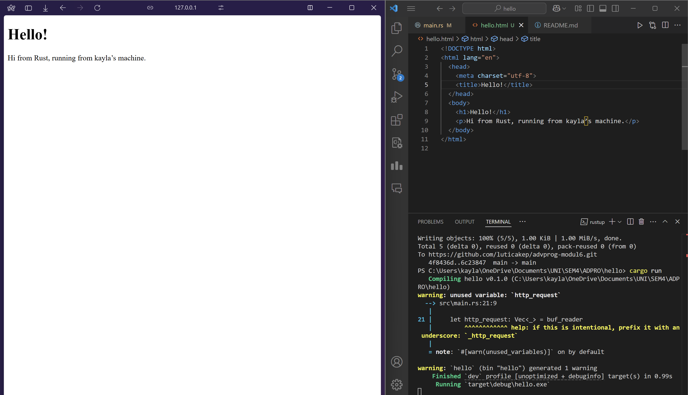
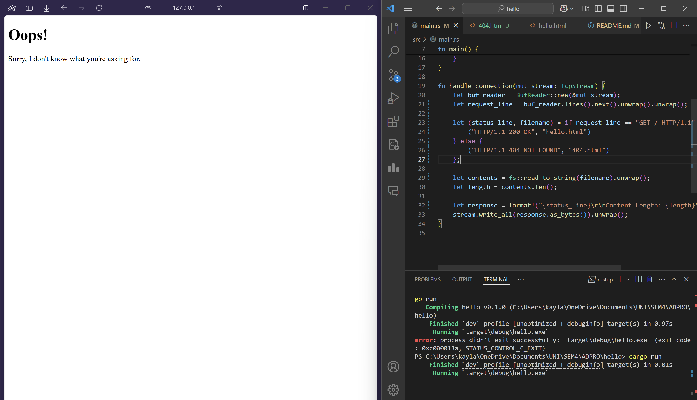

# Module 6

## Commit 1 Reflection notes: Handling connection and checking response
This Rust project implements a simple HTTP server that listens on 127.0.0.1:7878. The `handle_connection` function reads incoming requests line by line from a TcpStream and prints them in the terminal. Through this exercise, I learned how Rust ensures memory safety in network programming and how raw HTTP requests are structured. This exercise also helped me understand how to use Rust’s error handling features to gracefully handle I/O errors and other exceptions that may occur during network programming. Finally, I learned how to use the `cargo run` command to compile and run the server. This command automatically downloads and builds any dependencies, making it easy to get started with Rust projects.

## Commit 2 Reflection notes: Returning HTML

In this commit, I added a simple HTML response to the server. The `handle_connection` function now writes an HTTP response to the TcpStream, which includes a status line, headers, and a body. Through this exercise, I learned the importance of accurately specifying headers—especially the Content-Length—to ensure the client can correctly display the page. This experience also highlights how Rust’s safety guarantees and straightforward I/O handling make it simpler to serve dynamic or static content in a custom web server. Manually constructing the response helped me understand the exact structure of an HTTP packet. I realized that small mistakes in formatting the response can lead to confusing client-side errors, emphasizing the need for precision.

## Commit 3 Reflection notes: Validating request and selectively responding

In this commit, I added a conditional response to the server. The `handle_connection` function now checks if the incoming request is a GET request for the root path and responds with a 200 OK status code and the HTML content. If the request is for any other path, the server responds with a 404 Not Found status code and sends a `404.html`. This exercise helped me understand how to parse and validate HTTP requests in Rust and how to send appropriate responses based on the request type. It also demonstrated how Rust’s pattern matching and error handling features can be used to write clean and concise code. By selectively returning different pages, I gained insight into the basics of server-side routing and how to handle multiple endpoints.

## Commit 4 Reflection notes: Simulation slow response
I added a sleep function to simulate a slow response using `thread::sleep`. The main reason is to show how a single-threaded server can block new connections while it's busy. The `handle_connection` function now sleeps for 10 seconds before sending the response. By opening two browser windows pointing to 127.0.0.1/sleep and 127.0.0.1/, I observed that one request waits for the other to finish before responding. This exercise helped me understand how to handle slow requests in Rust and how to prevent blocking the server when processing long-running tasks. It also demonstrated how Rust’s asynchronous programming model can be used to improve the responsiveness of a web server by handling multiple requests concurrently.

## Commit 5 Reflection notes: Multithreaded server
I created a ThreadPool to manage multiple worker threads and handle incoming connections concurrently. By introducing a ThreadPool structure, we moved from a single-threaded design to one that can handle multiple requests concurrently. In the main function, I bound the server to 127.0.0.1:7878 using a TcpListener. Each worker in the pool listens on a shared queue of jobs, allowing multiple connections to be processed without blocking one another. Whenever a new connection arrives, I unwrapped the incoming stream for safe access. I then passed the handle_connection logic to the thread pool’s execute method so that each request is processed by a separate worker. As a result, the server is now far more responsive and capable of handling higher loads without stalling.

## Bonus reflection: Function improvement
I renamed the ThreadPool constructor method from `new` to `build` to more accurately convey that we’re constructing a pool with a specified capacity rather than just creating a default instance. This change helps clarify the purpose of the function, reflecting a more builder-oriented pattern.  
In `main.rs`, I updated the call site to `ThreadPool::build(4)` so the main application and the library code remain consistent. Making this update highlighted the importance of naming conventions in Rust. Also, ensuring both `lib.rs` and `main.rs` matched the new method name prevented compilation errors and kept the project cohesive. Overall, this iteration shows how small improvements in naming and structure can enhance the overall clarity and maintainability of the codebase.